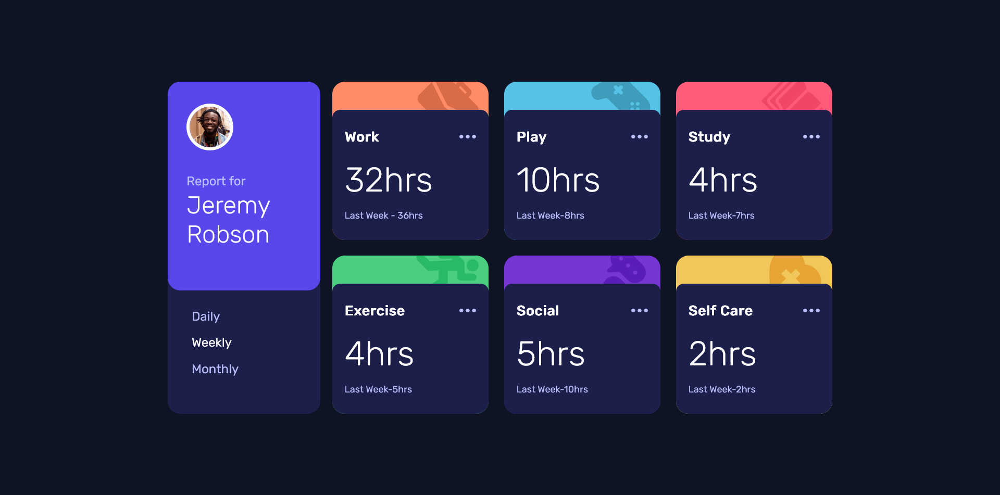

# Frontend Mentor - Time tracking dashboard solution

This is a solution to the [Time tracking dashboard challenge on Frontend Mentor](https://www.frontendmentor.io/challenges/time-tracking-dashboard-UIQ7167Jw). Frontend Mentor challenges help you improve your coding skills by building realistic projects. 

## Table of contents

- [Overview](#overview)
  - [The challenge](#the-challenge)
  - [Screenshot](#screenshot)
  - [Links](#links)
- [My process](#my-process)
  - [Built with](#built-with)
  - [What I learned](#what-i-learned)
  - [Useful resources](#useful-resources)
- [Author](#author)


## Overview

### The challenge

Users should be able to:

- View the optimal layout for the site depending on their device's screen size
- See hover states for all interactive elements on the page
- Switch between viewing Daily, Weekly, and Monthly stats

### Screenshot



### Links

- [Solution URL here](https://www.frontendmentor.io/solutions/time-tracking-dashboard-html-sass-js-2nBNUcmwto)
- [Live Site URL](https://limsael.github.io/time-tracking-dashboard/)

## My process

### Built with

- Semantic HTML5 markup
- CSS custom properties
- Flexbox
- CSS Grid
- Mobile-first workflow
- JavaScript


### What I learned

```js
function handleDailyClick() {
  dailyLink.classList.add("active");
  weeklyLink.classList.remove("active");
  monthlyLink.classList.remove("active");
  dailyActivities.style.display = "grid";
  weeklyActivities.style.display = "none";
  monthlyActivities.style.display = "none";
}
```

### Useful resources

- [Modzilla Developper Network](https://developer.mozilla.org/en-US/docs/Web/JavaScript)
- [Stack Overflow](https://stackoverflow.com/) 


## Author

- Frontend Mentor - [@limsael](https://www.frontendmentor.io/profile/limsael)
- Twitter - [@limsael525](https://www.twitter.com/limsael525)
